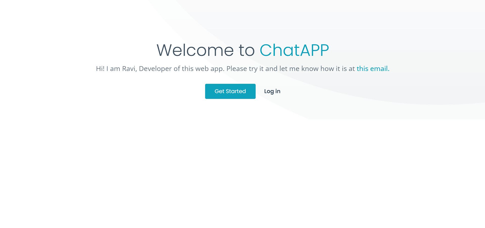
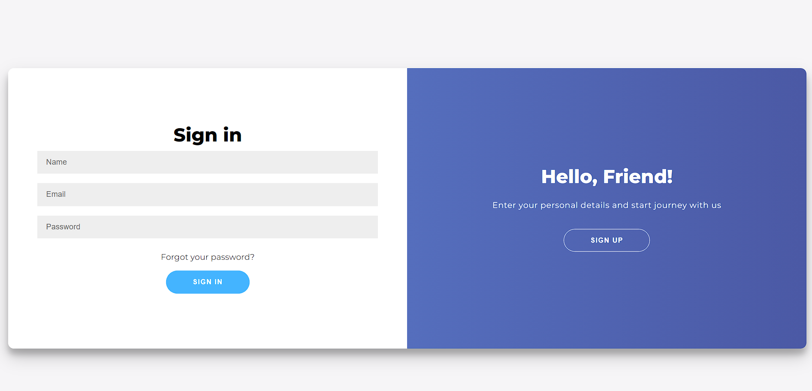
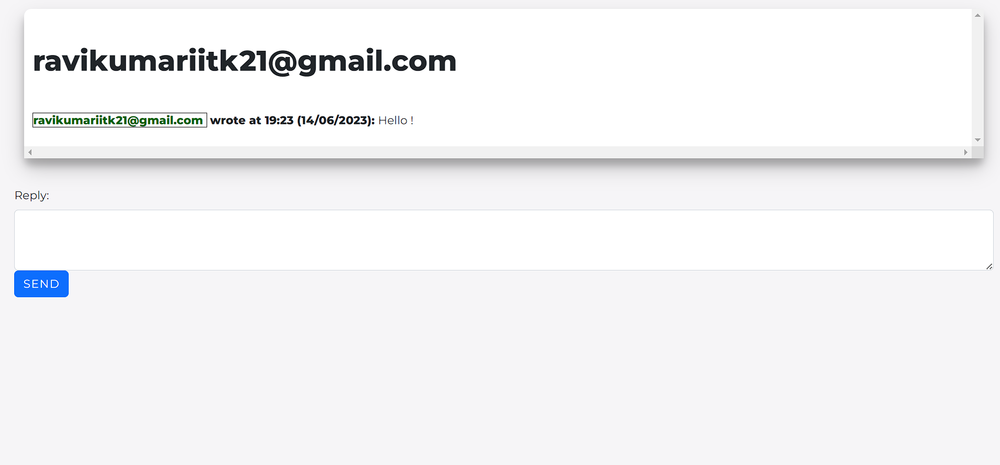
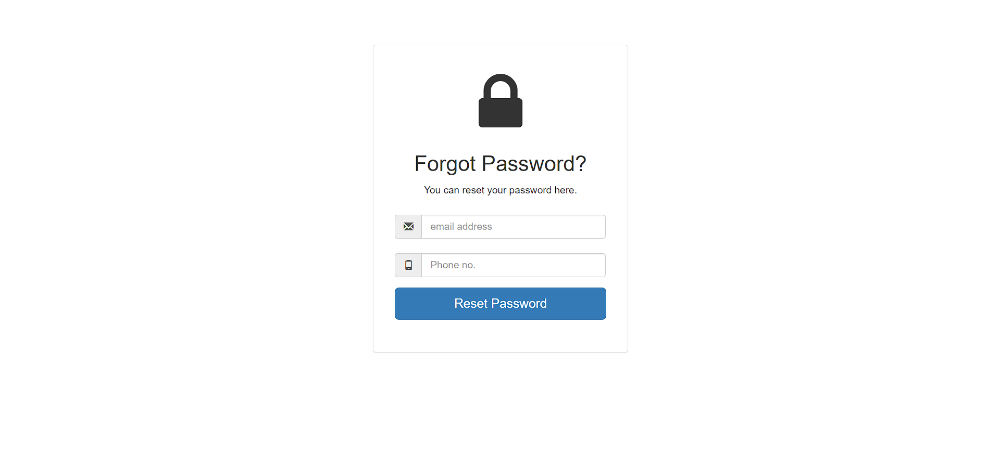

#ChatAPP

This is web chat application using this app one can chat to one ore more person at one time. This app is live <b> <a href="https://chatapp12.onrender.com/" target="_blank">Here</a></b> 

The main page of this website looks like:- 
 
TO get start click on <b>Getting Started</b> or <b>Log in</b> button. Then this page opens. 
 
If you are new here then click on <b>SIGN UP</b> button.
If not, just log-in with your email and password which was used for registration purpose earlier.
After login the user will be redirected to home page which looks like:-
 
For starting a new conversetion just type the email and the message and then click on the <b>Send</b> button. After that you will redirect to the conversetion page which looks like:-
 
If you have forgotten your password then click on the forget password on the sighn in page which will redirect you to reset password page which looks like:-
 
Here you have to type your registered email and phone no. and submit it after that a new window will appear which will ask you to type new password which looks like:-
 
Here you can reset your password very nicely. 

